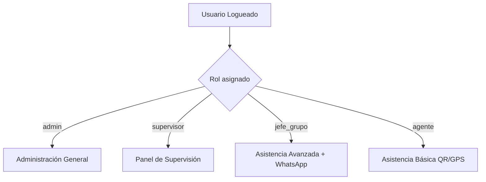

# 🛡️ DOCUMENTACIÓN DEL PROYECTO: Sistema de Control de Asistencia y Geolocalización (OSEDENA)

Este documento detalla el diagnóstico arquitectónico, flujos de datos, seguridad, capacidades offline y recomendaciones estratégicas para optimizar y potenciar el sistema de seguridad.

---

## 1. Visión General del Sistema
El sistema es una solución empresarial de alta fidelidad orientada a empresas de seguridad privada. Su objetivo primordial es garantizar la presencia física de los agentes en sus respectivas sedes de servicio mediante la combinación de **códigos QR únicos**, **geocercas GPS en tiempo real**, **captura fotográfica**, y un sistema robusto de **reportes de relevos** integrados con canales como **WhatsApp** y soporte completo para **operaciones sin conectividad a Internet (Offline-First)**.

---

## 2. Arquitectura de Software y Stack Tecnológico

La aplicación está construida sobre un ecosistema moderno y de alto rendimiento:

### Frontend
*   **Next.js 16.2.6 (App Router)**: Aprovecha las características más recientes de React Server Components (RSC) y optimizaciones de enrutamiento del lado del cliente.
*   **React 19.2.4**: Utiliza la última versión estable del core de React con mejor soporte para formularios, hooks concurrentes y optimizaciones de renderizado.
*   **Tailwind CSS v4.0 (con `@tailwindcss/postcss`)**: El estándar más rápido de diseño responsivo basado en tokens CSS.
*   **Zustand**: Gestor de estado ligero y reactivo para sincronizar la autenticación, la geolocalización, el estado offline y la UI en toda la aplicación.
*   **Dexie.js (IndexedDB local)**: Base de datos local transaccional e indexada que permite guardar marcaciones, reportes y ubicaciones en el dispositivo de forma persistente mientras esté desconectado.
*   **Leaflet & React-Leaflet**: Librería de mapas interactivos que permite renderizar mapas de las sedes, geocercas y ubicaciones en tiempo real para supervisores.
*   **Html5-Qrcode & QRCode**: Librerías cliente para escanear y generar códigos QR.

### Backend y Base de Datos (Supabase / PostgreSQL)
*   **Supabase SSR**: Manejo fluido de sesiones de usuario persistentes, sincronización en tiempo real y persistencia en almacenamiento seguro (Storage).
*   **PostGIS**: Extensión geoespacial dentro de PostgreSQL para realizar cálculos trigonométricos avanzados y georreferenciación nativa.
*   **Seguridad RLS (Row Level Security)**: Cada consulta REST respeta estrictamente los privilegios del token JWT del usuario logueado.
*   **Triggers en PL/pgSQL**: Lógica de base de datos automatizada para auditar logs, detectar tardanzas e impedir fraudes de ubicación.

---

## 3. Estructura de Roles y Flujos de Trabajo

El sistema segmenta los accesos y funcionalidades según cuatro roles diferenciados:



### A. Agente de Seguridad (`/agente`)
*   **Mi Código QR**: Visualización y descarga de su código de agente único.
*   **Marcación de Asistencia**:
    1.  **Escaneo**: Escanea el código QR de su sede o ingresa su código manualmente en caso de falla de cámara.
    2.  **GPS**: Valida su geolocalización (se asegura precisión militar < 100m).
    3.  **Confirmación**: Registra su hora exacta de Entrada o Salida.
*   **Historial**: Visualización histórica de todas sus marcaciones anteriores.

### B. Jefe de Grupo (`/agente` con privilegios extendidos)
*   Sigue el mismo flujo de marcación que el agente, pero se le requiere completar un **Parte Diario / Reporte de Relevo**:
    *   Ingresa el nombre del agente al que entrega o recibe el turno (relevo).
    *   Selecciona el estado de la sede (ej. *Casa Vacía, Personal Laborando, Almacén Abierto, Almacén Cerrado*).
    *   Genera un reporte formateado monoespaciado automáticamente.
    *   **Envío Directo**: Permite copiar el reporte o enviarlo directamente a través de **WhatsApp** al grupo de control correspondiente con un solo clic.

### C. Supervisor (`/supervisor`)
*   **Mapa en Tiempo Real**: Vista interactiva de las sedes con indicadores visuales de presencia.
*   **Control de Cobertura**: Panel para inspeccionar qué puestos de seguridad tienen cobertura completa en los turnos de día y noche.
*   **Gestión de Incidencias**: Validación o rechazo de reportes de tardanzas, fallos de GPS o reportes faltantes.
*   **Planificación**: Asignación de personal a sedes y turnos específicos.

### D. Administrador (`/admin`)
*   **CRUD completo** de Empresas, Sedes, Puestos de Control, Usuarios y Agentes.
*   **Generador Masivo de QR** para agentes y puestos de control.
*   **Configuración General**: Parámetros globales del sistema (como minutos de tolerancia para tardanzas, radio de geocercas por defecto, etc.).

---

## 4. Lógica de Seguridad y Blindaje del Negocio

El sistema cuenta con un diseño de base de datos extraordinariamente robusto para evitar manipulaciones:

### 📍 Validación GPS Inviolable en el Servidor (PostGIS)
Incluso si un usuario intenta alterar las coordenadas GPS en el navegador mediante herramientas de emulación (*Mock Locations*), el servidor ejecuta el trigger `trigger_validate_gps_asistencia` antes de guardar cualquier registro en `asistencia` o `reportes`:
1.  Obtiene las coordenadas registradas de la sede física (`latitud`, `longitud`) y el radio permitido de la geocerca (`radio_gps`).
2.  Calcula la distancia geodésica exacta en metros usando la función nativa de PostGIS:
    ```sql
    distancia_metros := ST_Distance(
      ST_MakePoint(NEW.longitud, NEW.latitud)::geography,
      ST_MakePoint(sede_lon, sede_lat)::geography
    );
    ```
3.  Si la distancia excede el radio configurado (ej: 100 metros), marca de forma irrevocable `gps_valido = FALSE` e inserta automáticamente una **Incidencia de GPS Inválido** en la tabla `incidencias` en estado `pendiente` para auditoría de los supervisores.

### ⏱️ Detección Automática de Tardanzas
El trigger `detectar_tardanza` se ejecuta automáticamente al insertar una marcación:
*   Obtiene el parámetro global de tolerancia (por defecto 15 minutos).
*   Evalúa el turno (`dia` = 07:00:00 o `noche` = 19:00:00).
*   Si la marcación se registra después del horario + tolerancia, crea inmediatamente una incidencia de tipo `tardanza` documentando el retraso para el posterior descuento o llamado de atención del supervisor.

---

## 5. El Motor Offline-First (Sincronización Inteligente)

Para garantizar la continuidad operativa en sótanos, almacenes o zonas remotas sin cobertura móvil:

1.  **Fallo de Red**: Si la marcación o el reporte fallan debido a problemas de conectividad, el hook `useAttendance` captura el fallo.
2.  **Encolamiento local**: Guarda el registro completo con los metadatos (incluyendo la foto capturada en formato DataURL) en la base de datos IndexedDB local mediante `Dexie.js` en la tabla `syncQueue`.
3.  **Backoff Exponencial**: El motor `SyncEngine` reintenta de forma automática la sincronización periódicamente, incrementando el tiempo de espera entre intentos (`2^intentos * 1s`) en caso de fallos repetidos para no agotar la batería del dispositivo del agente.
4.  **Carga de Fotos en Lotes**: Al recuperar conexión, el motor primero extrae la DataURL de la foto local, la sube al almacenamiento seguro (Supabase Storage) en la carpeta `offline/`, y actualiza el registro local con la URL pública generada.
5.  **Transacción Batch Única**: Envía todas las marcaciones offline acumuladas en una sola llamada RPC `sync_offline_payload(payload)` a la base de datos de Supabase, ejecutando todas las inserciones en una única transacción de base de datos para asegurar consistencia absoluta.

---

## 6. Recomendaciones de Mejora y Roadmap de Innovación

A partir de la revisión profunda del proyecto, te recomiendo implementar las siguientes mejoras estratégicas para convertir esta aplicación en un producto de nivel empresarial premium y asegurar la máxima satisfacción del cliente:

### 📱 1. Compresión de Imagen en el Cliente (Prioridad Alta)
Actualmente, las fotos tomadas por la cámara web del móvil o PC se envían directamente en su resolución cruda o en formato Base64 pesado.
*   **Problema**: Consumo excesivo de datos móviles de los agentes y lentitud al subir la marcación (una foto sin comprimir puede pesar de 2MB a 5MB).
*   **Solución**: Utilizar una función de compresión canvas en el navegador antes de guardar o enviar la foto, reduciendo su tamaño a una resolución de 800x600px en formato WebP con calidad del 70%. Esto reduce la imagen a solo **~100KB-150KB** sin perder legibilidad, logrando marcaciones instantáneas.

### 🎨 2. Interfaz Premium y Micro-animaciones (Wow Effect)
El sistema actual es altamente funcional, pero su diseño visual puede escalarse a un nivel "Premium" de clase mundial:
*   **Glassmorphism**: Implementar tarjetas con fondo translúcido y efecto de desenfoque (`backdrop-blur-md bg-card/75 border-white/10`) especialmente en los paneles móviles de los agentes.
*   **Micro-animaciones**: Agregar efectos de pulsación suave en los botones de "Escanear QR" y "Validar GPS", transiciones elegantes de entrada para los distintos pasos del formulario, e indicadores de carga animados personalizados en lugar del spinner clásico.
*   **Paleta de Colores Dinámica**: Usar degradados azulados y grises oscuros profundos con acentos en verde esmeralda y naranja vibrante para los estados del servicio, brindando una experiencia visual sumamente atractiva y profesional.

### 🔔 3. Notificaciones Push Nativas (Web Push)
Dado que ya cuentas con la tabla `notificaciones_push` y los campos de llaves VAPID en tu archivo de configuración `.env.local`:
*   **Solución**: Configurar el Service Worker del navegador para registrar suscripciones de Web Push. Esto permitirá a los supervisores enviar alertas de cambios de guardia, emergencias o recordatorios de marcar salida directamente a los teléfonos de los agentes, incluso cuando no tengan la pestaña de la aplicación abierta.

### 📍 4. Visualización Avanzada para el Supervisor
*   **Clustering de Sedes**: En el mapa de supervisión, agrupar las sedes cercanas cuando el zoom sea bajo para evitar sobrecarga visual de marcadores.
*   **Historial de Ruta (Trace Path)**: Dibujar líneas de ruta (`Polyline` en Leaflet) para mostrar el recorrido diario del supervisor o de los agentes según sus registros en `historial_ubicaciones`. Esto permitirá verificar rondas de patrullaje efectivas.

### 📦 5. Soporte PWA Total (Progressive Web App)
*   Configurar un manifiesto web completo (`manifest.json` mejorado) e implementar una estrategia de caché de red (*Cache First* para archivos estáticos) en el Service Worker.
*   Esto permitirá a los agentes "instalar" la aplicación en la pantalla de inicio de sus dispositivos móviles (Android e iOS) con un icono personalizado, eliminando la barra del navegador y haciendo que se comporte exactamente como una app nativa, mejorando el uso de la cámara y el GPS.

### 🎭 6. Verificación Facial Ligera (Reconocimiento Biométrico)
*   **Innovación**: Implementar una librería cliente ultra-liviana como `face-api.js` o modelos integrados de MediaPipe para validar que el rostro del agente que realiza la marcación coincide con su foto de perfil. Esto erradicaría por completo el fraude de agentes que le prestan su código QR a terceros para que marquen la asistencia por ellos.

---

*Elaborado por tu Asistente Antigravity, listo para empezar a programar contigo.*
